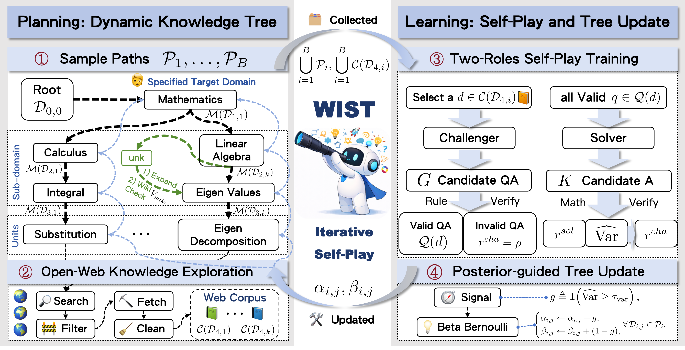

<div align="center">
  

  <h2>
    Web-Grounded Iterative Self-Play Tree for Domain-Targeted Reasoning Improvement
  </h2>

  <p>
    <a href="https://arxiv.org/abs/2603.22352">
      
    </a>
    <a href="https://github.com/lfy-123/WIST/blob/main/LICENSE">
      
    </a>
  </p>

  <p>
    <a href="README.md">English</a> | <a href="README_zh.md">简体中文</a>
  </p>
</div>


<p align="center">
  
</p>

## 🚀 What's New

- **[2026.04.06]** Our paper has been accepted to the **ACL 2026 Main Conference**. 🔥🔥🔥
- **[2026.04.04]** The **GitHub repository** is now publicly available.
- **[2026.03.22]** The paper was released on **[arXiv](https://arxiv.org/abs/2603.22352)**.

## ✨ Highlights

**WIST** (Web-Grounded Iterative Self-Play Tree) is a domain-targeted reasoning improvement framework built on top of [OpenRLHF](https://github.com/OpenRLHF/OpenRLHF). It fundamentally enhances language model capabilities by combining:

- 🌳 A dynamically expanding **domain tree**
- 🌐 **Open-web retrieval and cleaning** pipelines
- ⚔️ Challenger–Solver **self-play** mechanism
- 📈 Posterior-guided **curriculum updates**

<p align="center">
  
</p>

## 💡 About WIST
Recent progress in reinforcement learning with verifiable rewards (RLVR) offers a practical path to self-improvement of language models, but existing methods face a key trade-off: endogenous self-play can drift over iterations, while corpus-grounded approaches rely on curated data environments. 

We present **WIST**, a **W**eb-grounded **I**terative **S**elf-play **T**ree framework for domain-targeted reasoning improvement that learns directly from the open web without requiring any pre-arranged domain corpus. WIST incrementally expands a domain tree for exploration, retrieves and cleans path-consistent web corpus to construct a controllable training environment, and then performs Challenger-Solver self-play with verifiable rewards. The resulting learnability signals are fed back to update node posteriors, guiding subsequent exploration via an adaptive curriculum.

WIST consistently improves over base models and typically outperforms both purely endogenous self-evolution and corpus-grounded self-play baselines. For example, WIST achieves overall gains reaching **+9.8** on *Qwen3-4B-Base* and **+9.7** on *OctoThinker-8B*. It is highly domain-steerable, achieving **+14.79** on *Qwen3-8B-Base* in medicine and **+5.28** on *Qwen3-4B-Base* on PhyBench. 

---

## 🎬 Quick Start / Reproduction Guide

Follow the steps below to set up the repository, prepare data, run the self-play training, and evaluate the improved models.

### 1. Environment Setup

We recommend setting up a dedicated Conda environment. The project validates against the package list provided in `requirements.txt`.

```bash
conda create -n wist python==3.12.0 -y
conda activate wist
pip install -r requirements.txt
pip install -e .
```

**Core Dependencies:**
- `torch 2.7.1+cu126`
- `vllm 0.10.1`
- `ray 2.48.0`
- `deepspeed 0.16.8`
- `transformers 4.55.4`
- `flash_attn 2.8.3`
- `sentence_transformers 5.1.2`

---

### 2. Search Engine & Web Worker Initialization (Optional)

The training pipeline relies on dynamic queries generated by the web worker. Or you can also use your own search method.

**Step 2.1: Start the Search Engine**
If you are using a local [SearXNG](https://github.com/searxng/searxng) engine, start it first:
```bash
bash examples/scripts/web/worker_web_searxng.sh
```

**Step 2.2: Start the Web Worker**  
The web worker builds the domain tree and fetches open-web context. Keep this process running in the background.

Usage:
```bash
bash examples/scripts/web/worker_web.sh <max_levels> <model_name> <task_name>
```

*Examples by Domain:*
```bash
# Mathematics
bash examples/scripts/web/worker_web.sh 4 Qwen3-4B-Base wist_math_run

# Medicine
bash examples/scripts/web/worker_web.sh 4 Qwen3-4B-Base wist_medicine_run

# Physics
bash examples/scripts/web/worker_web.sh 4 Qwen3-4B-Base wist_physics_run
```

---

### 3. Run Self-Play Training

We provide a unified training script `train_wist.sh` to initialize self-play for any respective domain. The script takes positional arguments to configure the execution.

**Usage:**
```bash
bash examples/scripts/train_wist.sh <model_name> <max_levels> <gpu_count> <train_batch_size> <max_resample_attempts> <target_domain> <tree_window_size>
```

**Training Examples by Domain:**

- **Mathematics:**
  ```bash
  bash examples/scripts/train_wist.sh Qwen3-4B-Base 4 8 512 4 Mathematics 5
  ```
- **Medicine:**
  ```bash
  bash examples/scripts/train_wist.sh Qwen3-4B-Base 4 8 512 4 Medicine 5
  ```
- **Physics:**
  ```bash
  bash examples/scripts/train_wist.sh Qwen3-4B-Base 4 8 512 4 Physics 5
  ```
---

### 4. Evaluation

After training completes, evaluate the models on target benchmarks.

#### General Evaluation Suite
Use our unified evaluation script to run validations over standard datasets:
```bash
bash examples/scripts/eval/run_math.sh /path/to/trained_model
```
Supported tasks include: `math`, `mmlu-pro`, `bbeh`, `supergpqa`, `gpqa_diamond`.

#### Mathematics Specific Evaluation (Re-check)
```bash
export WIST_RESULTS_RECHECK_BASE_URL=""  # OpenAI API base URL
export WIST_RESULTS_RECHECK_API_KEY=""  # OpenAI API key
bash examples/scripts/eval/run_math_recheck.sh /path/to/results_xxx.json
```

#### Medicine & Physics Evaluation (OpenCompass)
Our Medicine and Physics evaluations are integrated with **[OpenCompass](https://github.com/open-compass/opencompass)**. Ensure you specify the correct OpenCompass directory.

```bash
export OPENCOMPASS_DIR=/path/to/opencompass

# For Medicine
bash examples/scripts/eval/run_opencompass_medicine.sh /path/to/trained_model

# For Physics
bash examples/scripts/eval/run_opencompass_physics.sh /path/to/trained_model
```

---

## 📖 Citation

If you find this repository helpful in your research, please consider citing the WIST paper:

```bibtex
@article{li2026wist,
  title={WIST: Web-Grounded Iterative Self-Play Tree for Domain-Targeted Reasoning Improvement},
  author={Li, Fangyuan and Li, Pengfei and Wang, Shijie and Gao, Junqi and Liu, Jianxing and Qi, Biqing and Li, Yuqiang},
  journal={arXiv preprint arXiv:2603.22352},
  year={2026}
}
```

## 🙏 Acknowledgement
We would like to sincerely thank the open-source community, in particular the (OpenRLHF)[https://github.com/OpenRLHF/OpenRLHF] project, for making this work possible.
